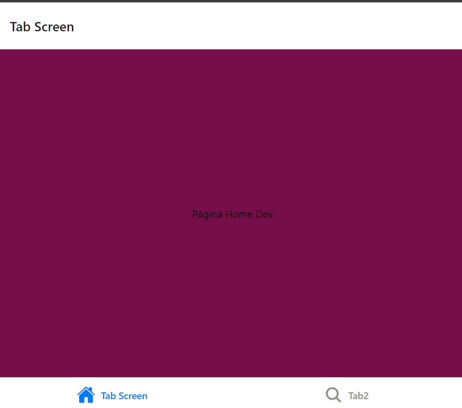
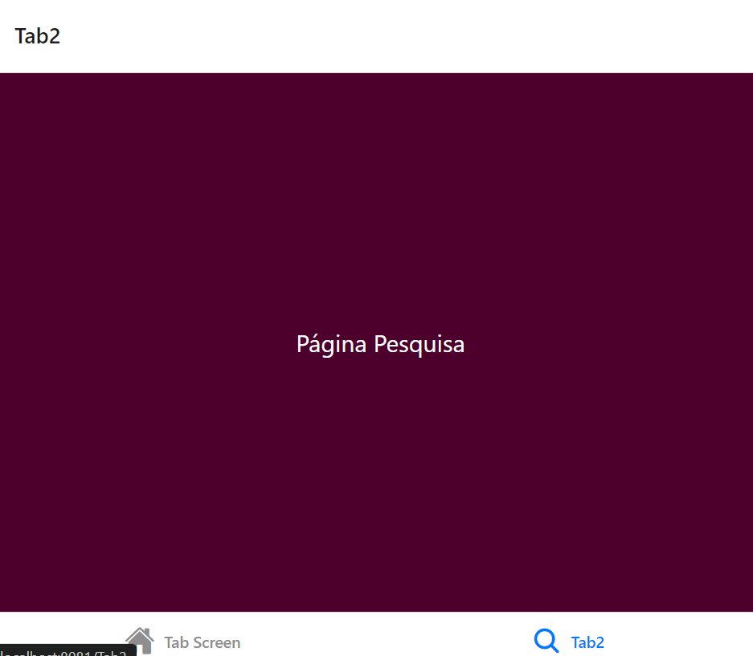

## 🚣 Navigation Botton Tab 

#### Este projeto foi desenvolvido como parte do curso técnico em Desenvolvimento de Sistemas do SENAI Valinhos, na disciplina de Back-End com o objetivo de aprimorar nossos conhecimentos em Mobile

## 📚 Descrição do Projeto

#### O repositório contém informações da matéria de Mobile com a utilidade de criar uma navegação com botão 

## 🛠 Tecnologias Utilizadas

#### ⚡ JavaScript
#### 👩‍💻 React Native

## Ao Clonar o projeto 👩‍💻

### Instale as dependências 🖥️

#### `cd nome-do-app`
#### `npm install`
#### `npx expo start`

### Resultado da página💻

